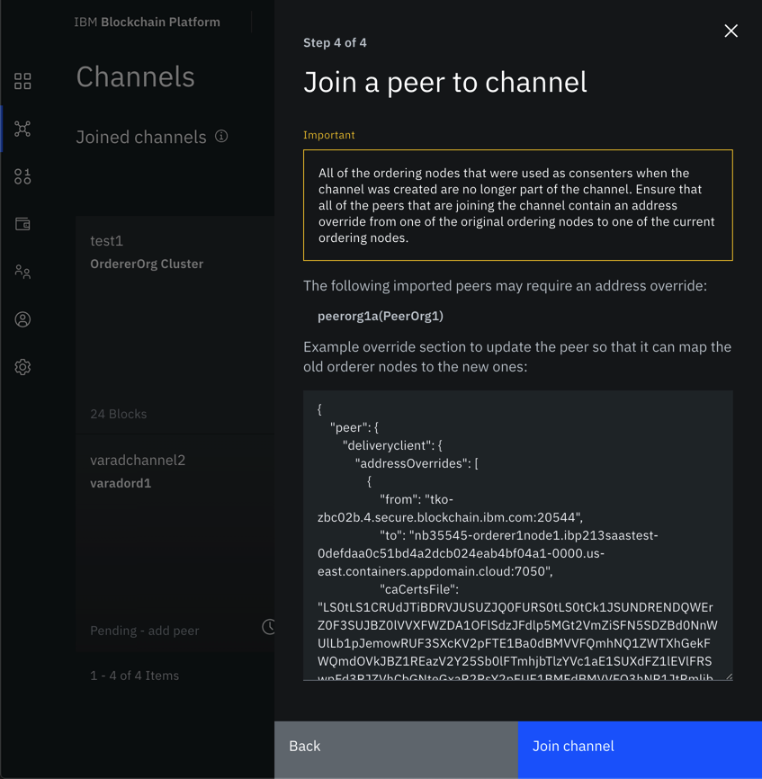
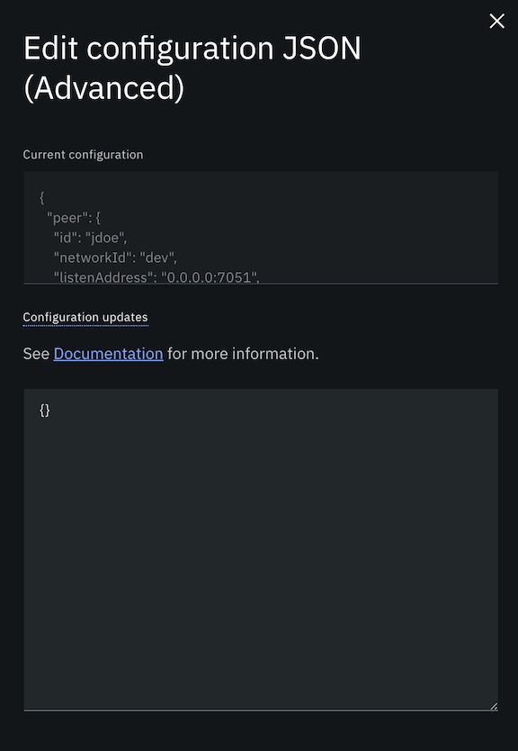

---

copyright:
  years: 2020
lastupdated: "2020-05-27"

keywords: IBM Blockchain Platform, blockchain, migration, orderer

subcollection: blockchain

---

{:shortdesc: .shortdesc}
{:screen: .screen}
{:codeblock: .codeblock}
{:note: .note}
{:important: .important}
{:tip: .tip}
{:pre: .pre}
{:external: target="_blank" .external}

# Mapping to existing ordering nodes
{: #orderer-mapping}

When a peer attempts to join a channel, it first pulls the initial configuration block (known as the genesis block) that was created when the channel was created. This block lists, among other things, the addresses of the ordering nodes that are consenters on the channel. As long as one of these nodes is still alive, the peer can pull down the ledger associated with this channel from that node and learn about any new ordering nodes that are now servicing the channel.

If none of the ordering nodes that were consenters on the channel are still up (as is the case at the end of the migration process), any peer attempting to join the channel will try and fail to connect to the nodes listed in the genesis block and be unable to proceed past that point.

In these cases, it is necessary to edit the configuration of the peer itself with a code snippet provided by the console. This code snippet will point the peer to one of the ordering nodes servicing the channel and allow the ledger of the channel to be pulled from that node.

## Editing the peer configuration
{: #orderer-mapping-code-snippet}

If your channel is in the state described above, in which none of the original ordering nodes are still servicing the channel, when attempting to join a peer to the channel the **Join a peer to the channel** screen will show a message similar to the following advising you that the configuration of the peer must include an "orderer override":

{: caption="Figure 1. Orderer override code snippet" caption-side="bottom"}

When you see this screen, **copy the code snippet**. Note the `addressOverrides` section. It should contain the address of one of the original ordering nodes as well as the address of one of the nodes now servicing the channel.

Then, **paste the code snippet into the configuration of the peer**. To do this:

1. Navigate to the peer from the **Nodes** panel.
2. Click on the **Settings** button inside the peer.
3. Under **Actions**, click on **Edit configuration JSON (Advanced)**.
4. In the box under **Configuration updates**, paste the code snipped you copied on the **Join a peer to the channel** page.
5. When you're ready, click **Update peer**.

The peer will automatically restart. When it is back up, you should be able to join the channel.

{: caption="Figure 1. Editing the peer configuration" caption-side="bottom"}

Note that you may have to edit the configuration of a peer multiple times, depending on the status of the ordering nodes on different channels. The override logic is designed to handle more than one "override" section in the peer configuration.

Don't copy the configuration snippet used as an override for one peer and use it on any other peers. Similarly, don't open the configuration of the peer and copy the section from that peer into another peer. **Use the code snippet provided on the Join a peer to a channel screen and paste it into the peer configuration** for each peer. This will ensure that the orderer override will work properly.
{: important}
