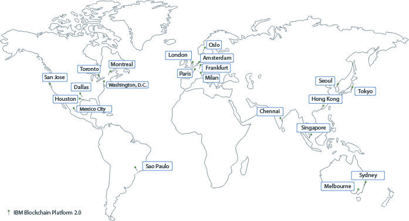

---

copyright:
  years: 2017, 2020
lastupdated: "2020-06-02"

keywords: data centers, IBM Cloud regions, available locations

subcollection: blockchain

---

{:external: target="_blank" .external}
{:shortdesc: .shortdesc}
{:screen: .screen}
{:pre: .pre}
{:note: .note}
{:table: .aria-labeledby="caption"}
{:codeblock: .codeblock}
{:tip: .tip}
{:download: .download}

# {{site.data.keyword.blockchainfull_notm}} Platform locations
{: #ibp-regions-locations}

{{site.data.keyword.cloud}} is hosted worldwide in various locations. Locations are data centers within a geographic area that is accessed by an endpoint. {{site.data.keyword.blockchainfull_notm}} Platform deploys blockchain networks within {{site.data.keyword.cloud_notm}} globally in different locations. When you create {{site.data.keyword.blockchainfull_notm}} Platform service instance in {{site.data.keyword.cloud_notm}}, your blockchain network and network resources are created and stored in the {{site.data.keyword.cloud_notm}} location where you create the service instance in.
{:shortdesc}

## {{site.data.keyword.blockchainfull_notm}} Platform for {{site.data.keyword.cloud_notm}}
{: #ibp-regions-locations-ibp}

To deploy the {{site.data.keyword.blockchainfull_notm}} Platform for {{site.data.keyword.cloud_notm}}, you need to select two locations:

1. You need to deploy a Kubernetes cluster on {{site.data.keyword.cloud_notm}}. You can deploy the cluster to any geography supported by the {{site.data.keyword.IBM_notm}} Kubernetes service or Red Hat OpenShift on {{site.data.keyword.cloud_notm}}. For more information, see the list of [locations for the {{site.data.keyword.IBM_notm}} Kubernetes service](/docs/containers?topic=containers-regions-and-zones) or [locations for OpenShift on {{site.data.keyword.cloud_notm}}](/docs/openshift?topic=openshift-regions-and-zones).

  {: caption="Figure 1. Kubernetes cluster on {{site.data.keyword.cloud_notm}} locations" caption-side="bottom"}

2. After you deploy a cluster on {{site.data.keyword.cloud_notm}}, you need to deploy an instance of the {{site.data.keyword.blockchainfull_notm}} Platform. The {{site.data.keyword.blockchainfull_notm}} Platform operational tooling can be deployed in each of the regions in the table below:

| Geography | Country | {{site.data.keyword.blockchainfull_notm}} Platform operational tools region |
|-----|-----|-----|
| Asia Pacific | Australia | Sydney |
| Asia Pacific | Japan | Tokyo |
| Europe | Germany | Frankfurt |
| Europe | United Kingdom | London |
| North America | United States | Dallas |
| North America | United States | Washington, D.C. |
{: caption="Table 1. {{site.data.keyword.blockchainfull_notm}} Platform for {{site.data.keyword.cloud_notm}} locations" caption-side="bottom"}

You can link an instance of the {{site.data.keyword.blockchainfull_notm}} Platform operational tooling to a cluster that is deployed at any location. However, all nodes provisioned by the console will be deployed in the location of the cluster. For example, if the Kubernetes cluster is located in Toronto and the linked console is in Washington, D.C., when you use the console to deploy a peer, the peer will reside in Toronto. For more information about the relationship between the operational tools and your cluster, see the [{{site.data.keyword.blockchainfull_notm}} Platform for {{site.data.keyword.cloud_notm}} architecture reference](/docs/blockchain?topic=blockchain-ibp-console-overview#ibp-console-overview-architecture).

## Enterprise Plan
{: #ibp-regions-locations-se}

Table 2 and Figure 2 show the {{site.data.keyword.cloud_notm}} regions and locations that **Enterprise Plan** supports.

| Location | Enterprise Plan |
|--------|----------|----------|
| Dallas | Y |
| London | Y |
| Tokyo | Y |
| Frankfurt | Y |
| Melbourne | Y |
| São Paulo | Y |
| Toronto | Y |
{: caption="Table 2. Enterprise Plan locations" caption-side="bottom"}
